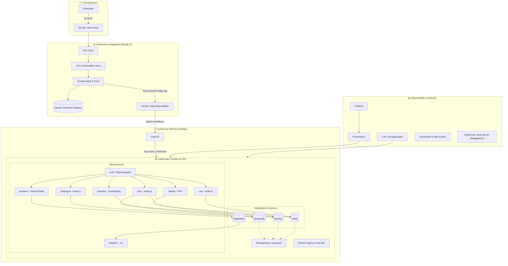

# 🚀 Robot Shop GitOps & DevSecOps Lab

> Xây dựng pipeline DevOps/GitOps và DevSecOps hoàn chỉnh cấp doanh nghiệp trên hạ tầng On-Premise (VMware Workstation), ứng dụng kiến trúc Microservices đa ngôn ngữ (Polyglot) với `instana/robot-shop`.

---

## 📌 Tổng Quan Kiến Trúc (Architecture Overview)

Dự án mô phỏng môi trường sản xuất thực tế tại doanh nghiệp, triển khai hạ tầng ảo hóa phân tán, tự động hóa từ khâu Source Code -> CI -> Bảo mật (DevSecOps) -> CD theo chuẩn GitOps -> Giám sát tập trung (Observability).



---

## 🗺️ Bản Đồ Hạ Tầng Mạng (Network Map)

| Máy ảo (VM) | IP Address | Vai trò & Dịch vụ |
|---|---|---|
| `gitlab-server` | `192.168.180.51` | GitLab Server, GitLab CI/CD, Container Registry |
| `k8s-master-1` | `192.168.180.101` | Kubernetes Control Plane (API Server, etcd, scheduler) |
| `k8s-master-2` | `192.168.180.102` | Kubernetes Worker Node 1 |
| `k8s-master-3` | `192.168.180.103` | Kubernetes Worker Node 2 |
| `rancher-server` | `192.168.180.104` | Rancher Cluster Management UI |
| `loadbalancer-k8s` | `192.168.180.105` | HAProxy Ingress Load Balancer |
| `database-server` | `192.168.180.106` | SonarQube Server, HashiCorp Vault, Trivy Server |

---

## 📂 Cấu Trúc Kho Lưu Trữ (Repository Structure)

```
.
├── ke-hoach-devops-robot-shop.md   # Lộ trình và kiến trúc 9 giai đoạn chi tiết
├── nhat-ky-trien-khai.md           # Nhật ký thực tế, sự cố & giải pháp (Troubleshooting)
├── robot-shop/                     # Mã nguồn microservices & Dockerfile
└── README.md                       # Tài liệu tổng quan dự án
```

---

## 🏆 Tiến Độ Triển Khai (Progress Roadmap)

- [x] **Giai đoạn 0:** Củng cố nền tảng cụm (StorageClass `local-path`, Ingress-Nginx, kiểm tra 3 nodes Ready).
- [x] **Giai đoạn 1:** Triển khai Robot Shop thủ công qua Helm làm mốc đối chứng (baseline), xử lý lỗi StorageClass của Redis.
- [x] **Giai đoạn 2:** Thiết lập Source Control trên GitLab on-premise, tách biệt Code Repo (`robot-shop`) và Config Repo (`robot-shop-deploy`), kích hoạt Container Registry.
- [x] **Giai đoạn 3:** Xây dựng CI Pipeline tự động (Test syntax -> Scan Trivy DevSecOps -> Docker Build & Push với tag Commit SHA).
- [ ] **Giai đoạn 4:** Thiết lập GitOps Continuous Delivery với ArgoCD (Tự động đồng bộ và Self-healing).
- [ ] **Giai đoạn 5:** Infrastructure as Code (Terraform & Ansible).
- [ ] **Giai đoạn 6:** DevSecOps (SonarQube Quality Gate + HashiCorp Vault).
- [ ] **Giai đoạn 7:** Giám sát tập trung (Prometheus + Grafana + Loki gom log).
- [ ] **Giai đoạn 8:** Load Balancer HAProxy & Kiểm thử tải với Locust.
- [ ] **Giai đoạn 9:** Đóng gói tài liệu portfolio hoàn chỉnh.

---

## 📖 Tài Liệu Chi Tiết

- Xem toàn bộ nhật ký sự cố và cách xử lý từng bước tại: [Nhật Ký Triển Khai (nhat-ky-trien-khai.md)](./nhat-ky-trien-khai.md).
- Xem kế hoạch thiết kế kỹ thuật tại: [Kế Hoạch Dự Án (ke-hoach-devops-robot-shop.md)](./ke-hoach-devops-robot-shop.md).
